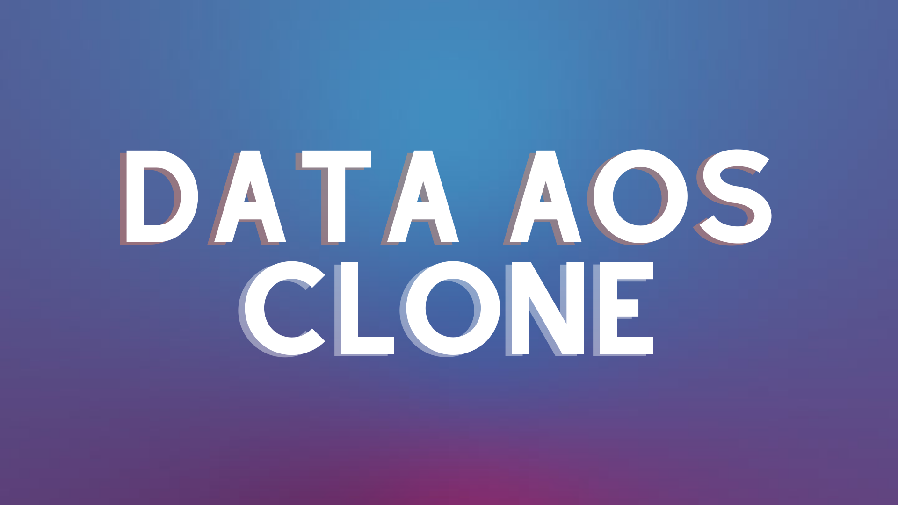

**Data AOS Clone by Eswar Benarjee**

## Table of Contents

- [About](#about)
- [Getting Started](#getting_started)
- [Usage](#usage)
- [Deployment](#deployment)
- [Built Using](#built_using)
- [Author](#author)

## About

This is a clone of the Data AOS website. The website is built using ReactJS, CSS3 and TailwindCSS.

## Getting Started

Install the AOS package from npm

```
npm install data-aos --save
```

## Usage

```
import AOS from 'aos';

<AOS dataAos="fade-up"></AOS>
```

## Deployment

Explore the documentation of AOS [here](https://data-aos-clone.vercel.app/)

## Built Using

- [NextJS](https://nextjs.org/) - Web Framework
- [TailwindCSS](https://tailwindcss.com/) - CSS Framework

## Author

- [**Eswar Benarjee**](http://eswarbenarjee.in/)
